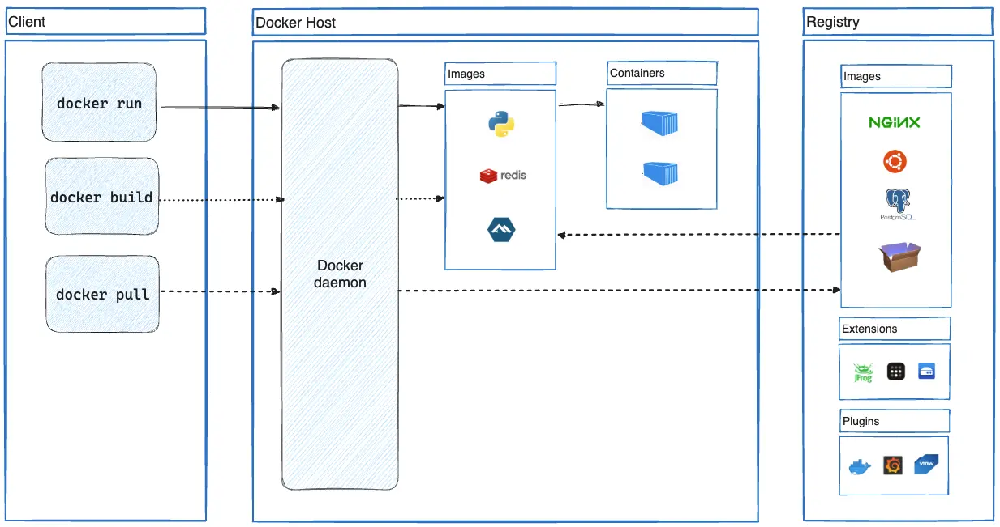

**Docker’s architecture**
Docker’s architecture is built on a client-server model that allows users to build, manage, and run containers efficiently. Below is an overview of the key components of Docker’s architecture

# Docker Client

The interface through which users interact with Docker.
Commands such as docker build, docker run, and docker pull are sent from the client to the Docker Daemon.
Can communicate with the daemon locally or remotely using a REST API

The Docker Client is a command-line interface (CLI) that acts as the primary way for users to interact with Docker. It allows users to issue commands to the Docker Daemon, which performs the actual work. Communication between the Docker Client and the Docker Daemon happens through a REST API, either locally (on the same machine) or remotely (on another machine)

**Ex:** Pull the nginx image: docker pull nginx
`Flow
Docker Client → REST API → Docker Daemon → Registry → Daemon → Client.`

`docker run -d -p 8080:80 nginx  :- Docker Client → REST API → Docker Daemon → Host → Container.`

**Local Communication**
Docker Client communicates with the Docker Daemon via a Unix socket (/var/run/docker.sock) on Linux or a named pipe on Windows.

**Docker Client Command Categories** The Docker Client supports a wide range of commands. Here’s a breakdown:

    a) Container Management
    docker run: Create and run a new container.
    docker stop: Stop a running container.
    docker start: Start a stopped container.
    docker rm: Remove a container.
    
    b) Image Management
    docker build: Build an image from a Dockerfile.
    docker pull: Download an image from a registry.
    docker push: Upload an image to a registry.
    docker rmi: Remove an image.
    
    c) System Management
    docker system prune: Remove unused data (e.g., dangling images, stopped containers).
    docker stats: Display resource usage statistics for running containers.
    
    d) Network Management
    docker network create: Create a new network.
    docker network ls: List existing networks.
    docker network connect: Connect a container to a network.
    
    e) Volume Management
    docker volume create: Create a new volume.
    docker volume inspect: Inspect volume details.
    docker volume rm: Remove a volume.
    
    f) Debugging and Logs
    docker logs: View logs from a container.
    docker exec: Execute a command inside a running container.
    docker inspect: Retrieve detailed information about an object (e.g., containers, images, volumes).
    
    g)Monitor Container Resource Usage:
    docker stats
    
    h)View Top Processes in a Container
    docker top <container-id>
    
    docker compose:Manages multi-container applications

**Working with Docker Contexts**

    A Docker Context defines endpoints and credentials for interacting with different Docker environments (e.g., local vs. cloud-based Docker hosts).
    
    Commands:
    docker context ls: List available contexts.
    docker context use <context-name>: Switch to a specific context.

    Example:
    docker context create myremote --docker "host=tcp://192.168.1.100:2375"
    docker context use myremote

**Environment Variables for Docker Client**

    Key Variables:
    DOCKER_HOST: Specifies the address of the Docker Daemon (e.g., tcp://<ip>:<port>).
    DOCKER_CERT_PATH: Path to certificates for TLS-secured communication.
    DOCKER_TLS_VERIFY: Enables TLS verification (1 for true, 0 for false).
    DOCKER_CONFIG: Path to the Docker configuration directory.

    Example:
    export DOCKER_HOST=tcp://192.168.1.100:2375
    export DOCKER_TLS_VERIFY=1
    export DOCKER_CERT_PATH=~/.docker/certs

**Debugging with Docker Client**

    Verbose Mode:
    Add --debug or -D to enable detailed output for troubleshooting:
    docker --debug ps
    Inspect Commands:
    
    Use docker inspect to retrieve detailed JSON metadata about objects.
    docker inspect <container-id>

**Application Logs**

    Do not rely on container logs for persistent logging. Use external logging systems like:
    ELK Stack (Elasticsearch, Logstash, Kibana)

**Use Orchestration Tools for Lifecycle Management**
Use tools like Kubernetes or Docker Swarm to automate the creation, scaling, and destruction of containers

# 2. Docker Daemon (dockerd)

   The core of Docker, responsible for running containers, managing images, and networks.
   Listens for requests from the Docker Client and manages Docker objects like images, containers, networks, and volumes.
   Runs in the background on the host machine.

The Docker Daemon, also known as dockerd, is the heart of Docker’s architecture. It runs in the background and handles the heavy lifting for Docker operations, such as building and running containers, pulling and managing images, and setting up networks and volumes

**Responsibilities of Docker Daemon**

    The Docker Daemon has several core responsibilities:
    
    a. Container Management
    Run Containers: Handles requests to start, stop, pause, or restart containers.
    Monitor Containers: Tracks the state of running containers and their resource usage.
    Terminate Containers: Cleans up resources when a container stops or is removed.

    b. Image Management
    Pull Images: Downloads images from Docker registries like Docker Hub.
    Build Images: Uses Dockerfile instructions to create custom images.
    Cache Layers: Optimizes image builds by caching intermediate layers.

    c. Network Management
    Create Networks: Sets up Docker networks for container communication.
    Connect Containers: Attaches containers to networks, enabling them to communicate.
    Isolate Containers: Ensures containers on different networks are isolated.

    d. Volume Management
    Create Volumes: Manages persistent data storage that outlives container lifecycles.
    Attach Volumes: Links volumes to containers to provide persistent storage

**Lifecycle of a Docker Daemon Request**
    
    Here’s how a typical request flows through the Docker system:
    
    Client Request:
    You run a command like docker run -d nginx.
    
    Request Sent to Daemon:
    The Docker Client translates this command into a REST API request and sends it to dockerd.
    
    Daemon Processes Request:
    
    If the nginx image isn’t available locally, dockerd pulls it from the registry.
    A container is created from the image.
    Resources like networks and volumes are set up.
    The container is started.

    Response to Client:
    The Docker Daemon sends a success message back to the Docker Client with details like container ID

**Key Features of Docker Daemon**

    a. Resource Control
    The Daemon uses control groups (cgroups) to allocate and restrict CPU, memory, and I/O resources for containers.
    
    b. Event System
    Generates events (e.g., container-start, container-die) that can be monitored for logging and orchestration.
    
    c. Pluggable Storage Drivers
    Supports multiple storage backends (e.g., overlay2, aufs) for managing container file systems.
    
    d. Built-in REST API
    Enables external tools and applications to interact with the daemon programmatically

**Starting and Managing the Daemon**

    a. Starting the Daemon
    On most systems, the Docker Daemon starts automatically as a service.
    To start it manually:
    sudo dockerd

    Restarting the Daemon
    sudo systemctl restart docker

**Daemon Logs**

    The Docker Daemon logs are essential for debugging and monitoring.
    
    Location:
    
    Linux: /var/log/docker.log
    Mac/Windows (Docker Desktop): Built-in logs viewer.
    Example: View logs in real-time using journalctl
    sudo journalctl -u docker.service

**Example Workflow with Docker Daemon**

    docker pull nginx
    docker run -d -p 80:80 nginx
    
    Docker Client sends a pull request to dockerd.
    The Daemon fetches the image layers from Docker Hub and stores them locally.
    The Daemon creates a container from the nginx image.
    Sets up network interfaces, assigns an IP, and exposes port 80.
    Starts the container in detached mode.

**Daemon Alternatives**
In some environments, tools like containerd or Podman are used instead of Docker Daemon, especially in Kubernetes setups.

# Docker Objects

**Images**

An image is a read-only template with instructions for creating a Docker container. Often, an image is based on another image, with some additional customization. For example, you may build an image which is based on the ubuntu image, but installs the Apache web server and your application, as well as the configuration details needed to make your application run.
You might create your own images or you might only use those created by others and published in a registry. To build your own image, you create a Dockerfile with a simple syntax for defining the steps needed to create the image and run it. Each instruction in a Dockerfile creates a layer in the image. When you change the Dockerfile and rebuild the image, only those layers which have changed are rebuilt. This is part of what makes images so lightweight, small, and fast, when compared to other virtualization technologies.

**Containers**

A container is a runnable instance of an image. You can create, start, stop, move, or delete a container using the Docker API or CLI. You can connect a container to one or more networks, attach storage to it, or even create a new image based on its current state.
By default, a container is relatively well isolated from other containers and its host machine. You can control how isolated a container's network, storage, or other underlying subsystems are from other containers or from the host machine.
A container is defined by its image as well as any configuration options you provide to it when you create or start it. When a container is removed, any changes to its state that aren't stored in persistent storage disappear.

# Docker Host

The physical or virtual machine where Docker Daemon runs.
Contains Docker objects (images, containers, volumes, and networks).
Can be a local system, a server, or a cloud-hosted machine.

**Docker Registry**
A repository to store and distribute Docker images.
Docker Hub is the default public registry, but private registries can also be configured.
Commands like docker pull and docker push interact with the registry.

**Visual Representation:**

    +-------------------+
    | Docker CLI/Client |  <-- User Interaction
    +-------------------+
    |
    v
    +-------------------+
    |   Docker Daemon   |  <-- Manages Containers, Images, etc.
    +-------------------+
    |
    v
    +-------------------+
    | Docker Host (OS)  |  <-- Runs Daemon and Containers
    +-------------------+
    |
    v
    +-------------------+
    | Docker Registry   |  <-- Stores Images (e.g., Docker Hub)
    +-------------------+
    

**Permission Issues**
Symptom: Permission denied when running docker commands.
Solution: Add your user to the docker group
sudo usermod -aG docker $USER

A **Dockerfile** is a text-based script that provides the instruction set on how to build the image. For this quick start, the repository already contains the Dockerfile

**What is a container?**

containers are isolated `processes` for each of your app's components. Each component - the frontend `React app, the Python API engine, and the database` - runs in its own `isolated environment`, completely isolated from everything else on your machine.

**Containers are:**

* Self-contained. Each container has everything it needs to function with no reliance on any pre-installed dependencies on the host machine.
* Isolated. Since containers are run in isolation, they have minimal influence on the host and other containers, increasing the security of your applications.
* Independent. Each container is independently managed. Deleting one container won't affect any others.
* Portable. Containers can run anywhere! The container that runs on your development machine will work the same way in a data center or anywhere in the cloud!

**Containers versus virtual machines (VMs)**
a VM is an entire operating system with its own kernel, hardware drivers, programs, and applications. Spinning up a VM only to isolate a single application is a lot of overhead.
A container is simply an isolated process with all of the files it needs to run. If you run multiple containers, they all share the same kernel, allowing you to run more applications on less infrastructure

**What is an image?**

Seeing a container is an isolated process, where does it get its files and configuration? How do you share those environments?
That's where container images come in. A container image is a standardized package that includes all of the files, binaries, libraries, and configurations to run a container.

**There are two important principles of images:**

Images are immutable. Once an image is created, it can't be modified. You can only make a new image or add changes on top of it.
Container images are composed of layers. Each layer represents a set of file system changes that add, remove, or modify files.
docker image history docker/welcome-to-docker

**What is a registry?**

Now that you know what a container image is and how it works, you might wonder - where do you store these images?
Well, you can store your container images on your computer system, but what if you want to share them with your friends or use them on another machine? That's where the image registry comes in.
An image registry is a centralized location for storing and sharing your container images. It can be either public or private.

While Docker Hub is a popular option, there are many other available container registries available today, including Amazon Elastic Container Registry(ECR), Azure Container Registry (ACR), and Google Container Registry (GCR).

**Registry vs. repository**

While you're working with registries, you might hear the terms registry and repository as if they're interchangeable. Even though they're related, they're not quite the same thing.
A registry is a centralized location that stores and manages container images, whereas a repository is a collection of related container images within a registry. Think of it as a folder where you organize your images based on projects. Each repository contains one or more container images.

* docker tag bhanupratapdocker/docker-quickstart bhanupratapdocker/docker-quickstart:1.0
* docker push bhanupratapdocker/docker-quickstart:1.0

**What is Docker Compose?**

**Building images**