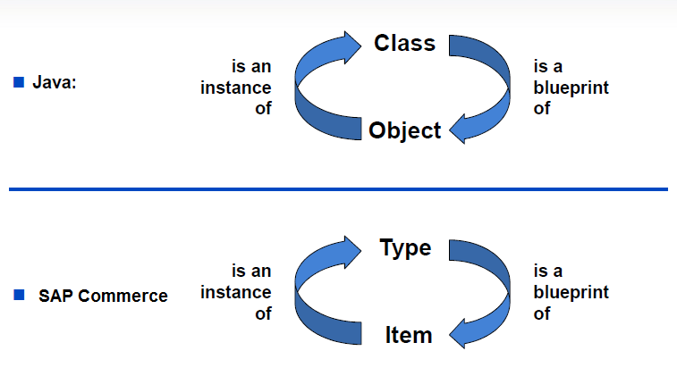
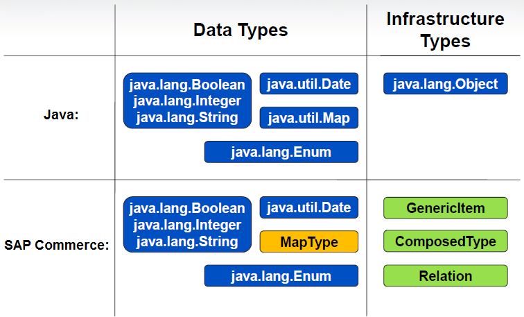
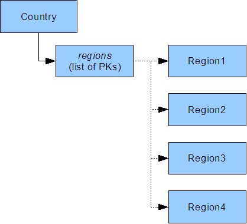
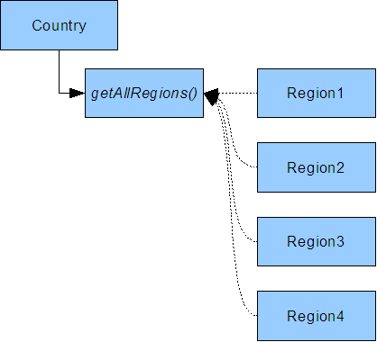

SAP Hybris - Modelling: The data model is base of application. Data model is define the structure of your application. Business logic is always based on top of the data model and helps an organize and maintain their database. In Hybris, each extension has <extension-name>-items.xml file. Data Models are define in same file

**Type System**

Items and Types
There are two major kinds of types: System-related types and business-related types.

System-related types make up or extend the type system itself and deal with internal data management:
Infrastructure types: ComposedTypes (also referred to as ItemTypes) set up type definitions and may carry attributes to hold information. In the end, every persistent object in the SAP Commerce is an instance of ComposedType or of one of its subtypes.
Data types: CollectionTypes, MapTypes, EnumerationTypes, and AtomicTypes. These are used to describe attributes: carrying attribute values or representations for these values or creating links between objects
Business-related types (like Order, Discount, Shoe) allow you to manage product and / or customer information so that you can run your business.
Items and items

To differentiate between normal object instances and type definitions, non-type objects in Platform are referred to as items. The lower case spelling item refers to an object in Platform; the upper case spelling Item refers to the type definition.
Type definitions are stored as instances of ComposedType (or a subtype of ComposedType), so the definitions of Item and Product as items are instances of ComposedTypes.

Type system is used for design data modeling or  organize data  in Hybris.  Types define an objects for manage and store data with Java implementation . For instance,  Java have class and object . Class is blueprint  of Object and Object is instance of Class. Same concept is follow in Hybris. Hybris is define Type and Item. Type is blueprint  of Item and Item is instance of type.

JAVA:        Class is blueprint  of Object  <-> Object is instance of Class.
HYBRIS:   Type is blueprint  of Item      <-> Item is instance of Type.

There are two kind of Types

System Related Type : It is extends type system itself and deal with manage internal data

    Data Type : It is used for define attribute value and representation type  as CollectionTypes, MapTypes, EnumerationTypes, and AtomicTypes . It is same like in Java  Date , Map , Enum etc.
    Infrastructure Type : It is called ItemType as well. It is carry attribute and hold information  as ComposedTypes , Relation. It is  same like Java Object

**Atomic vs. Composite Types:**

Atomic Types: Represent a single value, such as a number or string. Examples include String, Integer, Boolean, Date, etc.It is used to create as basic types in Hybris, which include Java number and string objects
an atomic type refers to a data type that represents a single, indivisible unit of data. These are basic types that cannot be further decomposed into smaller meaningful units, unlike composite or complex types that consist of multiple components.
Ex : PK ,DiscountValue,TaxValue,StandardDateRange,BigInteger
Unlike the other types, an AtomicType definition does not have a code attribute to set the unique identifier. Instead, the AtomicType class attribute is used as its reference.

Composite Types: Consist of multiple attributes or components. For example, a User object may contain several atomic types like name, email, address, or even references to other items (like orders).

**Characteristics of a ComposedType:**

Attributes and Associations: A ComposedType can have multiple attributes (of atomic or other composed types) and references to other types. For example, a Product ComposedType might have attributes like name, price, and description, as well as references to other items like Category or Supplier.
Extensibility: ComposedTypes in Hybris can extend other types, inheriting their attributes and behavior, which enables reusability and flexible design.
Persistence: ComposedTypes are typically mapped to database tables, with each attribute corresponding to a column, and associations may result in foreign key relationships.
Polymorphism: ComposedTypes allow for polymorphism, meaning you can define a type that extends from another type and override or extend its behavior.

**Runtime Management via TypeService:**

The TypeService API in Hybris allows you to interact with and manage types at runtime. You can query the type system, retrieve type definitions, or dynamically work with types.
Ex: ComposedTypeModel productType = typeService.getComposedTypeForClass(ProductModel.class);
Dynamic Attributes:ComposedTypes can also have dynamic attributes, which are calculated at runtime instead of being stored in the database.

**What is AbstractItemModel in SAP Hybris?**
AbstractItemModel is a core class in SAP Hybris used as the base class for all business models. It provides foundational functionalities that allow any model to interact with the Hybris platform's persistence layer and maintain certain properties, like primary keys (PK), attributes, and other basic behaviors like event handling and lifecycle management.

What is ItemModelContext in SAP Hybris?
ItemModelContext is a class in SAP Hybris that is closely related to the management of ItemModel instances, particularly focusing on tracking the lifecycle and state of models. It is part of the internal framework that facilitates the interactions between models and the persistence layer.

**Purpose of ItemModelContext**
The primary purpose of the ItemModelContext is to provide a structured environment for managing the state and persistence of Hybris models. It ensures that all operations (e.g., CRUD operations) on ItemModel instances are handled correctly, efficiently, and in a consistent manner

**What is ItemModelInternalContext in SAP Hybris?**
ItemModelInternalContext is an internal class in SAP Hybris that manages the internal state and lifecycle of an ItemModel. It is designed to handle the context in which an item model exists, particularly focusing on the persistence and state tracking of models during their lifecycle.

**Key Concepts and Hierarchy:**

* Inheritance of Item Types: The system defines a hierarchy where GenericItem is the most specific item type, inheriting from LocalizableItem, which in turn inherits from ExtensibleItem and so on. Each one extends the capabilities of the previous type.
* Attributes: Each item type has specific attributes (e.g., creationtime, pk, itemtype), and these can be used to store data specific to each type.
* Abstract vs Non-Abstract: The abstract item types like Item, ExtensibleItem, and LocalizableItem serve as templates. They cannot be instantiated directly, but other concrete types like GenericItem can be instantiated.
* These item types define the structure of data and how it will be persisted in the database.
* The Item type is the root, and subsequent item types (like ExtensibleItem, LocalizableItem, and GenericItem) inherit from it, adding more specialized functionality or attributes.

**Collection types** − It is used to build collection/group of element types
Collection Types are special data types used to represent collections of values or objects within the Hybris Type System. They allow attributes in a type to hold multiple values (e.g., lists, sets, or maps). Collection types are defined and configured in the items.xml

_Use RelationTypes whenever possible._
As the maximum length of the database field of a CollectionType is limited, a CollectionType with many values may end up getting its values truncated. In addition, the values of CollectionTypes are written in a CSV format and not in a normalized way. By consequence, SAP recommends using RelationTypes whenever possible.

CollectionType enforces type safety by restricting collections to store only a specific item type, defined at creation. For example, a StringCollection only accepts String values, similar to Java Generics. This prevents runtime type errors, ensures data consistency, and maintains system integrity by blocking incompatible types.
Ex:  <collectiontype code="PrincipalGroupCollection" elementtype="PrincipalGroup" autocreate="true" generate="false"/>
<collectiontype code="GenderList" elementtype="Gender" autocreate="true" generate="true" type="list" />
A CollectionInformation published on non-SAP site is a list of elements. A ListInformation published on non-SAP site is a number of ordered items. Although there may be equal items in a List, the items order is relevant. Items in a List may be accessed by an index counter. A SetInformation published on non-SAP site is an unordered number of items that must all be unique, no two items may be equal. A SortedSetInformation published on non-SAP site is the combination to a List and a Set. It contains a number of ordered items that must all be unique.
There are two types of relations that you can build with CollectionTypes: one to many relations and many to one relations. Both kinds of relation are unidirectional

**One-to-many relations**
* Keep links to the respective values via an attribute on the source item, for example, a list of Primary Keys
* If the CollectionType contains AtomicTypes, the values are stored as binary fields in the database. If it stores a collection of items, then those items' Primary Keys (PKs) are stored in the database in string form - a list of PKs, basically. As all the values of one CollectionType instance are stored as one single field, reading in and writing the values is quite fast as it is done in a single database access (especially with caching)
* If a collection contains a lot of PKs, the field value may reach the maximum length of field for the database implementation and entries may get truncated. That means that you can only store values of a certain length in that database field and every bit of information beyond that length gets lost.

    Search Limitations:
    Since the database only stores PKs, it cannot perform direct searches on the related data.
    Example:
    If a ProductCollection stores products by PKs, you cannot directly query all products in the collection with a specific attribute (e.g., name="Shoes").
    Instead, you must fetch all PKs, retrieve the associated items in memory, and filter them in Java, which is slower.

* As the database entry only contains the PKs (in other words: links to items) and not the items themselves, you cannot run database searches on the entries directly. Instead, you need to run searches in memory via Java, which is often slower than searching on the database directly.
  EX:
  Ambiguity in Matching:
  If a single CollectionType contains multiple matching entries, the database cannot count them directly.
  Example:
  A StringCollection with values ["red", "blue", "red"] is stored as binary.
  If you query for "red", the database cannot tell how many times "red" occurs—you must fetch the data and process it in memory.

**1:n and n:1 Approach** 

    n:1
    Why Use This Approach?
    Avoid Redundancy:
    
    The category name is stored once in the Category item, even if many products belong to the same category.
    If the category name changes, you update it in one place.
    Relational Integrity:
    
    This approach enforces relationships and ensures that categories and products remain logically linked in the database.
    Scalability:
    
    For large datasets, storing attribute values in target items improves organization and prevents bloated source items.
    the Country type has an attribute regions that stores a list of the PKs of the regions.
    

    Many-to-one relations (n:1)
    Store the attribute values at the respective target items and have a getter method at the source type to retrieve the values
    
    graphic, Country has a getter method called getAllRegions() that runs a FlexibleSearch statement on the database to find all instances of Region.
    
    This explanation refers to a relationship between two entities, Country and Region, which is not directly stored as a one-to-many attribute in the database but is instead established through a custom getter method that fetches related entities using a FlexibleSearch query

    Key Characteristics of This Relationship

    Performance Advantages:
    FlexibleSearch results are cached in SAP Commerce.
    This caching reduces repeated database queries for the same data, improving performance.
    No Field Length Limitation:
    
    Unlike a CollectionType where Primary Keys (PKs) of related items are stored in a single field, here no direct attribute links the entities.
    This avoids limitations like the maximum field length in the database.
    Manual Getter Implementation:
    
    You must implement a custom getter method (e.g., getAllRegions() in Country) that retrieves related entities using FlexibleSearch.

    How It Works

    Database Design
    There is no explicit database column or attribute in the Country table to store the relationship with Region.
    Instead, Region has a column (e.g., countryPk) that references its parent Country.
    FlexibleSearch Query
    The getter method executes a FlexibleSearch query like:
    
    java
    Copy code
    SELECT {pk} FROM {Region} WHERE {country} = ?country
    This query finds all regions associated with the given country based on the countryPk.

    Use an Impex file to establish the relationship indirectly:

    impex
    Copy code
    INSERT_UPDATE Country; isocode[unique=true]; name[lang=en]
    ; US                  ; United States
    
    INSERT_UPDATE Region; isocode[unique=true]; name[lang=en]; country(isocode)
    ; CA                  ; California  ; US
    ; TX                  ; Texas       ; US

    Retrieving Regions
    Fetch regions for a country:
    
    java
    Copy code
    CountryModel country = modelService.get(CountryModel.class, "US");
    List<RegionModel> regions = country.getAllRegions();
    
    regions.forEach(region -> System.out.println("Region: " + region.getName()));
    
    Benefits of This Approach
    Caching:
    
    FlexibleSearch queries benefit from the SAP Commerce caching layer, so repeated queries for the same data are faster.
    Avoids Field Length Limitations:
    
    No PKs or concatenated strings are stored in a single database field, avoiding truncation risks.
    Flexibility:
    
    The relationship is determined dynamically via queries, providing more control over how data is fetched.

`Many-to-one (n:1) relations are very much like one-to-many relations, only the other way around. Even if implemented differently, from a logical point of view, a many-to-one relation is just another representation of a o`ne-to-many relation.