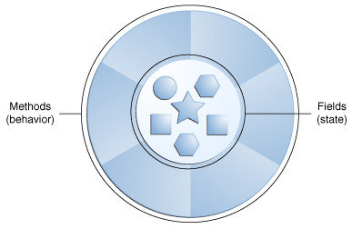
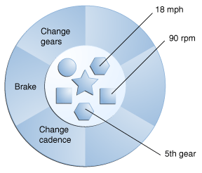

* **Inheritance (IS-A Relationship)**

   Definition: A class inherits the properties and behavior of another class.

   Keywords: extends, super, override, polymorphism, method overriding, upcasting, downcasting.

   Key Points:

   Supports code reuse.
   Single inheritance in Java (no multiple inheritance for classes).
   Enables runtime polymorphism via method overriding.

* **Aggregation (Weak HAS-A Relationship)**

   Definition: One class has a reference to another class (loose coupling).

   Keywords: HAS-A, association, independent lifecycle.

   Key Points:

   Objects can exist independently of each other.
   Used for relationships like "owns" or "uses."

   class Car {
   Engine engine;
   }

* **Composition (Strong HAS-A Relationship)**

   Definition: One class is composed of another class (strong coupling).

   Keywords: HAS-A, composition, dependent lifecycle, final.

   Key Points:

   The contained object’s lifecycle is dependent on the container object.
   Stronger association than aggregation.

   Example:
   
   class Library {
   private final Book book;
   }

* **Dependency**

   Definition: A class depends on another class for its functionality (loosely coupled).

   Keywords: dependency, method parameter, local variable, Dependency Injection.

   Key Points:

   Temporary association.
   Promotes loose coupling.
   Common in design patterns.

   Example:

   class Printer {
   void print(Document doc) {}
   }

**Technical Keywords to Use**

* Object-Oriented Programming (OOP)
* Coupling (tight vs loose)
* Lifecycle dependency
* Polymorphism (runtime, compile-time)
* Encapsulation (in the context of access modifiers in inheritance)
* Generalization and Specialization (inheritance concepts)
* Multiplicity (association types)
* Dependency Injection (for Dependency relationships)

**Object-Oriented Programming (OOP)**
Definition: A programming paradigm based on the concept of "objects" that contain data (fields) and methods (functions) to manipulate that data.
Key Principles:

Encapsulation: Bundling data and methods that operate on the data within a single unit (class).

Inheritance: Creating a new class based on an existing class.

Polymorphism: One interface, multiple implementations.

Abstraction: Hiding implementation details and showing only the essential features

**Coupling (Tight vs Loose)**
Definition: The degree of dependency between two classes or components in a system.

Types:

Tight Coupling: Classes are highly dependent on each other, making the code harder to maintain and scale.

Loose Coupling: Classes interact with each other through interfaces or abstractions, reducing direct dependencies.

**Lifecycle Dependency**

Definition: The relationship between objects where one object's lifecycle is dependent on another's.

Types:

    Independent Lifecycle: Objects can exist independently of each other (Aggregation).
    
    Example: A Student and a School can exist independently.
    
    Dependent Lifecycle: One object's existence depends on the other (Composition).
    
    Example: A Library cannot exist without Books

**Object-Oriented Programming Concepts**

**What Is an Object?**
An object is a software bundle of related state and behavior

    A software object.

Software objects are conceptually similar to real-world objects: they too consist of state and related behavior. An object stores its state in fields (variables in some programming languages) and exposes its behavior through methods (functions in some programming languages). Methods operate on an object's internal state and serve as the primary mechanism for object-to-object communication. Hiding internal state and requiring all interaction to be performed through an object's methods is known as data encapsulation — a fundamental principle of object-oriented programming.

**What Is an Interface?**
An interface is a contract between a class and the outside world. When a class implements an interface, it promises to provide the behavior published by that interface.and this contract is enforced at build time by the compiler. If your class claims to implement an interface, all methods defined by that interface must appear in its source code before the class will successfully compile.
an interface is a group of related methods with empty bodies

**What Is a Class?**
A class is a blueprint or prototype from which objects are created.